# Local-LLM

**Local LLM Utilities for Offline NLP Pipelines**

`local-llm` is a lightweight Python library for running open-source language models completely offline.
It includes:

* **BERT checkpoint conversion** (TensorFlow → PyTorch)
* A dependency-minimal **WordPiece tokenizer**
* A **BERT-style input encoder** that produces `input_ids`, `token_type_ids`, and `attention_mask`
* A simple PyTorch **classification head** for downstream training
* Full test coverage to ensure reliability and long-term maintainability

This project is designed for restricted or air-gapped environments where:

* Internet access is not allowed
* Model downloads must be avoided
* Reproducibility and transparency are required
* External ML ecosystems (HF Hub, cloud APIs) cannot be used

---

## Features

### ✔ Offline BERT checkpoint conversion

Convert standard **TensorFlow 1.x** BERT checkpoints to PyTorch format:

```python
from local_llm.convert import setup_bert_base

assets_dir = setup_bert_base(
    checkpoints="path/to/checkpoint_dir",
    vocab="path/to/vocab.txt",
    config="path/to/bert_config.json",
    output_dir="path/to/output_assets",
)
```

This produces:

```
pytorch_model.bin
config.json
vocab.txt
```

### ✔ Clean WordPiece tokenizer (no HuggingFace required)

* Accurate greedy-longest-match WordPiece implementation
* Proper handling of `[CLS]`, `[SEP]`, `[MASK]`, etc.
* BasicTokenizer handles case folding, accents, punctuation splitting

```python
from local_llm.tokenization import build_bert_input_encoder

encoder = build_bert_input_encoder(assets_dir, max_len=256)
encoded = encoder.encode("This is an example.")
```

### ✔ Lightweight PyTorch inference & training

```python
from local_llm import BertTextClassifier

model = BertTextClassifier.from_pretrained(assets_dir, num_labels=8)
```

Supports:

* CLS pooling or mean pooling
* GPU acceleration when available
* Fine-tuning with standard PyTorch optimizers

---

## Installation

```bash
pip install -e .
```

### Requirements

* Python ≥ 3.9
* PyTorch ≥ 2.0
* TensorFlow ≥ 2.12 (only for checkpoint conversion)
* NumPy ≥ 1.23

GPU support requires installing a **CUDA-enabled PyTorch build**.

---

## Project Structure

```
local-llm/
│
├── notebooks/
│   ├── finetune_demo.ipynb     # Fine-tune BERT for Sequence Classication 
│   ├── inference_demo.ipynb    # Run Inference with BERT on Unlabeled Data
│   └── setup_demo.ipynb        # Setup Local-LLM for BERT Sequence Classification
|
├── src/local_llm/
│   ├── convert.py              # TF → PyTorch conversion logic
│   ├── models/                 # PyTorch wrappers/classifiers
│   ├── pipelines/              # Pipelines for task deployment
│   ├── tokenization/           # Basic + WordPiece tokenizers
│   ├── training/               # Ecoder + Head Config and Finetuning logic
│   └── __init__.py
│
├── tests/
│   ├── test_convert.py
│   ├── test_bert_wordpiece.py
│   ├── test_bert.py
│   └── ...
│
├── README.md
└── pyproject.toml
```

---

## Usage

### 1. Convert a TensorFlow BERT checkpoint

```python
from local_llm.convert import setup_bert_base

assets = setup_bert_base(
    checkpoints="./uncased_L-12_H-768_A-12",
    vocab="./uncased_L-12_H-768_A-12/vocab.txt",
    config="./uncased_L-12_H-768_A-12/bert_config.json",
)
```

---

### 2. Encode text

```python
from local_llm.tokenization import build_bert_input_encoder

encoder = build_bert_input_encoder(assets, max_len=128)
encoded = encoder.encode("Example sentence for encoding.")
```

The result contains:

* `input_ids`
* `token_type_ids`
* `attention_mask`

---

### 3. Run inference

```python
from local_llm import BertTextClassifier
import torch

model = BertTextClassifier.from_pretrained(assets, num_labels=4)
model.eval()

batch = torch.tensor([encoded.input_ids])
logits = model(input_ids=batch)["logits"]
```

---

### 4. Fine-tune the classifier

```python
model.train()
optimizer = torch.optim.Adam(model.parameters(), lr=1e-4)

loss = model(
    input_ids=batch,
    labels=torch.tensor([1])
)["loss"]

loss.backward()
optimizer.step()
```

GPU is used automatically if available.

---

## Testing

This project includes extensive tests for:

* Vocabulary loading
* Basic tokenization
* WordPiece segmentation
* Input encoding
* TF → PyTorch conversion
* Classification head

Run all tests:

```bash
pytest
```

All tests pass on Python 3.13 and PyTorch 2.9.

---

## Why This Project Exists

Many enterprise and government environments:

* Restrict external dependencies
* Require fully offline model execution
* Need transparent, auditable ML systems
* Cannot fetch models from HuggingFace or cloud APIs

`local-llm` provides a **fully compliant**, **offline**, and **self-contained** BERT pipeline for such environments.

---

## License

Not sure the rules here, tbh. Don't steal my work! Honor system. 

---

## Contact / Maintainer

**Cameron Webster**
*([cameron.webster@nnsa.doe.gov](mailto:cameron.webster@nnsa.doe.gov))*


# TESTING NEW VERION


# **Local-LLM**

### *Offline BERT Utilities for Secure, Air-Gapped NLP Pipelines*

`Local-LLM` is a lightweight, auditable Python library that enables **fully offline** NLP workflows based on the original Google Research **BERT** model architecture.
It is specifically designed for restricted government and enterprise environments where:

* Internet access is limited or forbidden
* External ML frameworks (HuggingFace, cloud APIs, online checkpoints) cannot be used
* Reproducibility, transparency, and long-term maintainability are required

The library provides:

* 🧩 **TensorFlow → PyTorch conversion** for standard BERT checkpoints
* ✂️ A complete **WordPiece tokenizer** (no external dependencies)
* 🔧 A BERT-compatible **input encoder**
* 🧠 A minimal PyTorch **sequence classification head**
* 🎯 Fully integrated **training & inference pipelines**
* 🧪 A comprehensive **test suite** for reliability and future maintenance

---

# **Download the Original Google BERT Checkpoints**

Local-LLM requires the standard TensorFlow BERT releases from Google:

➡ **Google Research BERT Repository**:
[https://github.com/google-research/bert](https://github.com/google-research/bert)

You may download any of the official pretrained models, such as:

* `uncased_L-12_H-768_A-12`
* `cased_L-12_H-768_A-12`
* `uncased_L-24_H-1024_A-16`
* etc.

These folders include:

```
bert_config.json
vocab.txt
bert_model.ckpt.data-00000-of-00001
bert_model.ckpt.index
```

Local-LLM converts these into a PyTorch-native format for offline use.

---

# **Key Features**

### **✔ 1. Offline BERT Checkpoint Conversion**

Convert official TensorFlow BERT checkpoints into a PyTorch `state_dict`:

```python
from local_llm.convert import setup_bert_base

assets_dir = setup_bert_base(
    checkpoints="./uncased_L-12_H-768_A-12",
    vocab="./uncased_L-12_H-768_A-12/vocab.txt",
    config="./uncased_L-12_H-768_A-12/bert_config.json",
    output_dir="./assets/bert-base-local",
)
```

This produces:

```
pytorch_model.bin
config.json
vocab.txt
```

All future operations (tokenization, training, inference) require only these three files.

---

### **✔ 2. Clean WordPiece Tokenizer (Dependency-Free)**

Local-LLM includes a complete BERT tokenizer:

```python
from local_llm.pipelines.text_classification import build_bert_input_encoder

encoder = build_bert_input_encoder(
    assets_dir="./assets/bert-base-local",
    max_len=256,
    lowercase=True,
)

encoded = encoder.encode("Example sentence for encoding.")
```

Returns:

* `input_ids`
* `token_type_ids`
* `attention_mask`

The implementation is fully deterministic and thoroughly tested.

---

### **✔ 3. BERT Model (Pure PyTorch, No HF Dependencies)**

```python
from local_llm.models.bert import BertConfig, BertModel

config = BertConfig(hidden_size=768, num_hidden_layers=12)
model = BertModel(config)
```

The architecture matches the original Google Research implementation, supporting:

* Multi-head self-attention
* Transformer encoder layers
* GELU, ReLU, tanh, and new GELU activation mappings
* Finetuning policies (`none`, `full`, `last_n`)

---

### **✔ 4. Built-In Sequence Classifier**

```python
from local_llm.pipelines.text_classification import BertTextClassifier

classifier = BertTextClassifier(
    bert=model,
    num_labels=4,
    pooling="cls",
)
```

Supports:

* CLS pooling or mean pooling
* Customizable linear head (`ClassifierHeadConfig`)
* GPU acceleration

---

#### **BERT Model Architecture (Local-LLM Implementation)**

```mermaid
flowchart LR
    %% =========================
    %% HIGH-LEVEL BERT PIPELINE
    %% =========================

    %% Stage 1: Text -> Tokens
    A[Input text<br/>raw sentence(s)] --> B[Tokenization<br/>basic tokenizer + WordPiece];

    %% Stage 2: Tokens -> IDs & masks
    B --> C[[input_ids<br/>token_type_ids<br/>attention_mask]];

    %% Stage 3: IDs -> Embeddings
    C --> D[Embedding layer<br/>token + position + segment];

    %% Stage 4: Encoder stack
    D --> E[BERT encoder stack<br/>Transformer layer × N];

    %% Stage 5: Pooling & classifier
    E --> F[Pooling<br/>[CLS] vector or mean];
    F --> G[Classifier head<br/>dense layer + softmax];
    G --> H[Predicted label];

    %% =====================================
    %% DETAIL: A SINGLE TRANSFORMER LAYER
    %% =====================================
    subgraph ENC["Single BERT encoder layer"]
        direction TB
        E_in((hidden states_in)) --> MHA[Multi-head self-attention];
        MHA --> AddNorm1[Add & LayerNorm];
        AddNorm1 --> FFN[Position-wise feed-forward];
        FFN --> AddNorm2[Add & LayerNorm];
        AddNorm2 --> E_out((hidden states_out));
    end

    %% Attach layer detail to the encoder stack
    E --- ENC;

    %% ==========
    %% STYLING
    %% ==========
    classDef data fill:#e0f2fe,stroke:#0369a1,stroke-width:1px,color:#0f172a;
    classDef tensor fill:#ecfdf5,stroke:#15803d,stroke-width:1px,color:#022c22;
    classDef op fill:#f9fafb,stroke:#4b5563,stroke-width:1px,color:#111827;
    classDef encdetail fill:#fefce8,stroke:#a16207,stroke-width:1px,color:#713f12;

    class A,H data;
    class C tensor;
    class B,D,E,F,G op;
    class ENC,MHA,FFN,AddNorm1,AddNorm2,E_in,E_out encdetail;
```


### **✔ 5. Full Fine-Tuning Pipeline**

All steps needed to finetune BERT on labeled data are provided:


```python
from local_llm.training.text_finetune import (
    FineTuneConfig,
    set_seed,
    prepare_label_mapping,
    stratified_split_indices,
    encode_splits,
    build_dataloaders,
    build_bert_text_classifier_from_assets,
    train_text_classifier,
    evaluate_on_split,
    save_finetuned_classifier,
)
```

The library includes a complete recipe covering:

1. Load labeled data
2. Map string labels → integer IDs
3. Stratified train/val/test split
4. Tokenization
5. Dataset + dataloaders
6. Building the classifier
7. Full training loop with logging
8. Saving finetuned weights
9. Running inference and exporting predictions

See the demo notebooks for examples.

---

#### **Fine-Tuning Workflow (text_finetune.py)**

```mermaid
flowchart LR
    A["Raw CSV data<br/>text columns + label column"] --> B["prepare_label_mapping()<br/>convert labels to IDs"]
    B --> C["concat_text()<br/>join selected text columns"]
    C --> D["stratified_split_indices()<br/>train / val / test indices"]

    D --> E["build_input_encoder()<br/>load vocab and tokenizer"]
    E --> F["encode_splits()<br/>encode each split to tensors"]

    F --> G["build_dataloaders()<br/>PyTorch DataLoaders for each split"]

    G --> H["build_bert_text_classifier_from_assets()<br/>load BERT + classifier head<br/>set finetune policy"]

    H --> I["train_text_classifier()<br/>train on train loader<br/>evaluate on val loader<br/>track best state"]

    I --> J["save_finetuned_classifier()<br/>save classifier_full.pt<br/>save pytorch_model_finetuned.bin<br/>write finetune_meta.json"]

    J --> K["evaluate_on_split()<br/>run inference on test tensors"]
    K --> L["export_predictions_csv()<br/>write predictions + confidence to CSV"]

```




### **✔ 6. Inference Pipeline for Unlabeled Data**

The library also includes a dedicated inference helper:

```python
from local_llm.inference import load_finetuned_classifier, predict_dataframe

model, meta = load_finetuned_classifier("./artifacts/finetune_bert")

df_pred = predict_dataframe(
    df_unlabeled,
    text_cols=["col1","col2"],
    encoder_assets=meta["assets_dir"],
    model=model,
)
```

Produces predicted label IDs, labels, and confidence scores.

---

### **✔ 7. Fully Tested**

Tests cover:

* WordPiece tokenizer
* Basic tokenization rules
* BERT encoder
* Activation functions (ACT2FN)
* Attention masking
* Conversion correctness
* Classification head behavior
* Finetuning pipeline steps

Run all tests:

```bash
pytest
```

---

# **Installation**

### **Editable install (recommended for development)**

```bash
pip install -e .
```

### Requirements

* Python ≥ 3.9
* PyTorch ≥ 2.0
* TensorFlow ≥ 2.12 (only needed for conversion; not needed for inference/train)
* NumPy ≥ 1.23
* Pandas ≥ 2.0
* GPU support requires CUDA-enabled PyTorch

---

# **Project Structure**

```
local-llm/
│
├── notebooks/
│   ├── setup_demo.ipynb
│   ├── finetune_demo.ipynb
│   └── inference_demo.ipynb
│
├── src/local_llm/
│   ├── convert.py
│   ├── models/
│   │   └── bert.py
│   ├── pipelines/
│   │   └── text_classification.py
│   ├── tokenization/
│   │   └── bert_wordpiece.py
│   ├── training/
│   │   └── text_finetune.py
│   ├── inference/
│   │   └── inference.py
│   └── __init__.py
│
├── tests/
│   ├── test_convert.py
│   ├── test_bert.py
│   ├── test_bert_wordpiece.py
│   ├── test_text_classification.py
│   └── test_text_finetune.py
│
├── README.md
└── pyproject.toml
```

---

# **Example Workflow**

## **Step 1 — Convert Google TF Checkpoints**

```python
from local_llm.convert import setup_bert_base

assets = setup_bert_base(
    checkpoints="./uncased_L-12_H-768_A-12",
    vocab="./uncased_L-12_H-768_A-12/vocab.txt",
    config="./uncased_L-12_H-768_A-12/bert_config.json",
    output_dir="./assets/bert-base-local",
)
```

---

## **Step 2 — Finetune on Labeled Data (Full Pipeline)**

See `notebooks/finetune_demo.ipynb` for the guided tutorial.

---

## **Step 3 — Run Inference on Unlabeled Data**

See `notebooks/inference_demo.ipynb`.

---

# **Why Local-LLM Exists**

Government and enterprise organizations often need:

* Fully offline NLP capability
* Zero external dependencies
* Deterministic, auditable code
* Long-term maintainability
* Security posture compliant with air-gapped environments

Local-LLM was built precisely for these requirements.

It enables secure, reproducible, high-quality NLP—without HuggingFace, cloud APIs, or external downloads.

---

# **Maintainer**

**Cameron Webster**
National Nuclear Security Administration
[cameron.webster@nnsa.doe.gov](mailto:cameron.webster@nnsa.doe.gov)

---