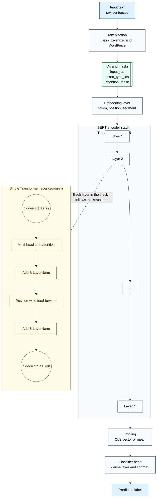

# **Local-LLM**

**NLP Pipeline Utilities for Air-Gapped Environments**

`Local-LLM` is a lightweight, auditable Python library that enables **fully offline** NLP workflows based on the original Google Research **BERT** model architecture.
It is specifically designed for restricted government and enterprise environments where:

* Internet access is limited or forbidden
* External ML frameworks (HuggingFace, cloud APIs, online checkpoints) cannot be used
* Reproducibility, transparency, and long-term maintainability are required

The library provides:

*  **TensorFlow → PyTorch conversion** for standard BERT checkpoints
*  A complete **WordPiece tokenizer** (no external dependencies)
*  A BERT-compatible **input encoder**
*  A minimal PyTorch **sequence classification head**
*  Fully integrated **training & inference pipelines**
*  A comprehensive **test suite** for reliability and future maintenance

---

**Download the Original Google BERT Checkpoints**

Local-LLM requires the standard TensorFlow BERT releases from Google:

**Google Research BERT Repository**:
[https://github.com/google-research/bert](https://github.com/google-research/bert)

You may download any of the official pretrained models, such as:

* `uncased_L-12_H-768_A-12`
* `cased_L-12_H-768_A-12`
* `BERT-Large, Uncased (Whole Word Masking)`

### Downloadable, Pre-trained BERT Models

| **BERT Model** | **Transformer Blocks** | **Hidden Size** | **Self-Attention Heads** | **Parameters (Millions)** | **Size** |
|:--------------:|:----------------------:|:---------------:|:------------------------:|:-------------------------:|:--------:|
| [BERT-Tiny](https://storage.googleapis.com/bert_models/2020_02_20/uncased_L-2_H-128_A-2.zip) | 2 | 128 | 2 | 4.4 | 17,319 KB |
| [BERT-Mini](https://storage.googleapis.com/bert_models/2020_02_20/uncased_L-4_H-256_A-4.zip) | 4 | 256 | 4 | 11.3 | 44,016 KB |
| [BERT-Small](https://storage.googleapis.com/bert_models/2020_02_20/uncased_L-4_H-512_A-8.zip) | 4 | 512 | 8 | 29.1 | 113,512 KB |
| [BERT-Medium](https://storage.googleapis.com/bert_models/2020_02_20/uncased_L-8_H-512_A-8.zip) | 8 | 512 | 8 | 41.7 | 162,768 KB |
| [BERT-Base](https://storage.googleapis.com/bert_models/2020_02_20/uncased_L-12_H-768_A-12.zip) | 12 | 768 | 12 | 110.1 | 430,104 KB |
| [BERT-Large, Uncased (Whole Word Masking)](https://storage.googleapis.com/bert_models/2019_05_30/wwm_uncased_L-24_H-1024_A-16.zip) | 24 | 1024 | 16 | 340 | 1.3 GB |
| [BERT-Large, Cased (Whole Word Masking)](https://storage.googleapis.com/bert_models/2019_05_30/wwm_cased_L-24_H-1024_A-16.zip) | 24 | 1024 | 16 | 340 | 1.3 GB |

These folders include:

```
bert_config.json
vocab.txt
bert_model.ckpt.data-00000-of-00001
bert_model.ckpt.index
```

Local-LLM converts these into a PyTorch-native format for offline use.

---

# **Features**

### **1. Offline BERT Checkpoint Conversion**

Convert official TensorFlow BERT checkpoints into a PyTorch `state_dict`:

```python
from local_llm.convert import setup_bert_base

assets_dir = setup_bert_base(
    checkpoints="./uncased_L-12_H-768_A-12",
    vocab="./uncased_L-12_H-768_A-12/vocab.txt",
    config="./uncased_L-12_H-768_A-12/bert_config.json",
    output_dir="./assets/bert-base-local",
)
```

This produces:

```
pytorch_model.bin
config.json
vocab.txt
```

All future operations (tokenization, training, inference) require only these three files.

---

### **2. Dependency-Free WordPiece Tokenizer**

Local-LLM includes a complete BERT tokenizer:

```python
from local_llm.pipelines.text_classification import build_bert_input_encoder

encoder = build_bert_input_encoder(
    assets_dir="./assets/bert-base-local",
    max_len=256,
    lowercase=True,
)

encoded = encoder.encode("Example sentence for encoding.")
```

Returns:

* `input_ids`
* `token_type_ids`
* `attention_mask`

The implementation is fully deterministic and thoroughly tested.

---

### **3. BERT Model (Pure PyTorch, No HF Dependencies)**

```python
from local_llm.models.bert import BertConfig, BertModel

config = BertConfig(hidden_size=768, num_hidden_layers=12)
model = BertModel(config)
```

The architecture matches the original Google Research implementation, supporting:

* Multi-head self-attention
* Transformer encoder layers
* GELU, ReLU, tanh, and new GELU activation mappings
* Finetuning policies (`none`, `full`, `last_n`)

---

### **4. Built-In Sequence Classifier**

```python
from local_llm.pipelines.text_classification import BertTextClassifier

classifier = BertTextClassifier(
    bert=model,
    num_labels=4,
    pooling="cls",
)
```

Supports:

* CLS pooling or mean pooling
* Customizable linear head (`ClassifierHeadConfig`)
* GPU acceleration

---

#### **BERT Model Architecture (Local-LLM Implementation)**



### **5. Full Fine-Tuning Pipeline**

All steps needed to finetune BERT on labeled data are provided:

```python
from local_llm.training.text_finetune import (
    FineTuneConfig,
    set_seed,
    prepare_label_mapping,
    stratified_split_indices,
    encode_splits,
    build_dataloaders,
    build_bert_text_classifier_from_assets,
    train_text_classifier,
    evaluate_on_split,
    save_finetuned_classifier,
)
```

The library includes a complete recipe covering:

1. Load labeled data
2. Map string labels → integer IDs
3. Stratified train/val/test split
4. Tokenization
5. Dataset + dataloaders
6. Building the classifier
7. Full training loop with logging
8. Saving finetuned weights
9. Running inference and exporting predictions

See the demo notebooks for examples.

---

#### **Fine-Tuning Workflow (text_finetune.py)**

```mermaid
flowchart LR
    A["Raw CSV data<br/>text columns + label column"] --> B["prepare_label_mapping()<br/>convert labels to IDs"]
    B --> C["concat_text()<br/>join selected text columns"]
    C --> D["stratified_split_indices()<br/>train / val / test indices"]

    D --> E["build_input_encoder()<br/>load vocab and tokenizer"]
    E --> F["encode_splits()<br/>encode each split to tensors"]

    F --> G["build_dataloaders()<br/>PyTorch DataLoaders for each split"]

    G --> H["build_bert_text_classifier_from_assets()<br/>load BERT + classifier head<br/>set finetune policy"]

    H --> I["train_text_classifier()<br/>train on train loader<br/>evaluate on val loader<br/>track best state"]

    I --> J["save_finetuned_classifier()<br/>save classifier_full.pt<br/>save pytorch_model_finetuned.bin<br/>write finetune_meta.json"]

    J --> K["evaluate_on_split()<br/>run inference on test tensors"]
    K --> L["export_predictions_csv()<br/>write predictions + confidence to CSV"]

```




### **6. Inference Pipeline for Unlabeled Data**

The library also includes a dedicated inference helper:

```python
from local_llm.inference import load_finetuned_classifier, predict_dataframe

model, meta = load_finetuned_classifier("./artifacts/finetune_bert")

df_pred = predict_dataframe(
    df_unlabeled,
    text_cols=["col1","col2"],
    encoder_assets=meta["assets_dir"],
    model=model,
)
```

Produces predicted label IDs, labels, and confidence scores.

---

### **7. Fully Tested**

Tests cover:

* WordPiece tokenizer
* Basic tokenization rules
* BERT encoder
* Activation functions (ACT2FN)
* Attention masking
* Conversion correctness
* Classification head behavior
* Finetuning pipeline steps

Run all tests:

```bash
pytest
```

---

# **Installation**

### **Editable install (recommended for development)**

```bash
pip install -e .
```

### Requirements

* Python ≥ 3.9
* PyTorch ≥ 2.0
* TensorFlow ≥ 2.12 (only needed for conversion; not needed for inference/train)
* NumPy ≥ 1.23
* Pandas ≥ 2.0
* GPU support requires CUDA-enabled PyTorch

---

# **Project Structure**

```
local-llm/
│
├── notebooks/
│   ├── setup_demo.ipynb
│   ├── finetune_demo.ipynb
│   └── inference_demo.ipynb
│
├── src/local_llm/
│   ├── convert.py
│   ├── models/
│   │   └── bert.py
│   ├── pipelines/
│   │   └── text_classification.py
│   ├── tokenization/
│   │   └── bert_wordpiece.py
│   ├── training/
│   │   └── text_finetune.py
│   ├── inference/
│   │   └── inference.py
│   └── __init__.py
│
├── tests/
│   ├── test_convert.py
│   ├── test_bert.py
│   ├── test_bert_wordpiece.py
│   ├── test_text_classification.py
│   └── test_text_finetune.py
│
├── README.md
└── pyproject.toml
```

---

# **Example Workflow**

## **Step 1 — Convert Google TF Checkpoints**

```python
from local_llm.convert import setup_bert_base

assets = setup_bert_base(
    checkpoints="./uncased_L-12_H-768_A-12",
    vocab="./uncased_L-12_H-768_A-12/vocab.txt",
    config="./uncased_L-12_H-768_A-12/bert_config.json",
    output_dir="./assets/bert-base-local",
)
```

---

## **Step 2 — Finetune on Labeled Data (Full Pipeline)**

```python
splits = encode_splits(df, train_idx, val_idx, test_idx, cfg)
loaders = build_dataloaders(splits, cfg)
model = build_bert_text_classifier_from_assets(cfg, num_labels)
history, best_state = train_text_classifier(model, loaders, cfg)
save_finetuned_classifier(model, best_state, cfg, label_to_id, id_to_label)
```

See `notebooks/finetune_demo.ipynb` for the guided tutorial.

---

## **Step 3 — Run Inference on Unlabeled Data**

See `notebooks/inference_demo.ipynb`.

---

# **Why Local-LLM Exists**

Government and enterprise organizations often need:

* Fully offline NLP capability
* Zero external dependencies
* Deterministic, auditable code
* Long-term maintainability
* Security posture compliant with air-gapped environments

Local-LLM was built precisely for these requirements.

It enables secure, reproducible, high-quality NLP—without HuggingFace, cloud APIs, or external downloads.

---

# **Maintainer**

**Cameron Webster**
_National Nuclear Security Administration_
[cameron.webster@nnsa.doe.gov](mailto:cameron.webster@nnsa.doe.gov)

---

# Citations

```python
@article{devlin2018bert,
  title={BERT: Pre-training of Deep Bidirectional Transformers for Language Understanding},
  author={Devlin, Jacob and Chang, Ming-Wei and Lee, Kenton and Toutanova, Kristina},
  journal={arXiv preprint arXiv:1810.04805},
  year={2018}
}
```
```python
@misc{hendrycks2023gaussianerrorlinearunits,
      title={Gaussian Error Linear Units (GELUs)}, 
      author={Dan Hendrycks and Kevin Gimpel},
      year={2023},
      eprint={1606.08415},
      archivePrefix={arXiv},
      primaryClass={cs.LG},
      url={https://arxiv.org/abs/1606.08415}, 
}
```
```python
@article{turc2019,
  title={Well-Read Students Learn Better: On the Importance of Pre-training Compact Models},
  author={Turc, Iulia and Chang, Ming-Wei and Lee, Kenton and Toutanova, Kristina},
  journal={arXiv preprint arXiv:1908.08962v2 },
  year={2019}
}
```
```python
@misc{vaswani2023attentionneed,
      title={Attention Is All You Need}, 
      author={Ashish Vaswani and Noam Shazeer and Niki Parmar and Jakob Uszkoreit and Llion Jones and Aidan N. Gomez and Lukasz Kaiser and Illia Polosukhin},
      year={2023},
      eprint={1706.03762},
      archivePrefix={arXiv},
      primaryClass={cs.CL},
      url={https://arxiv.org/abs/1706.03762}, 
}
```
---